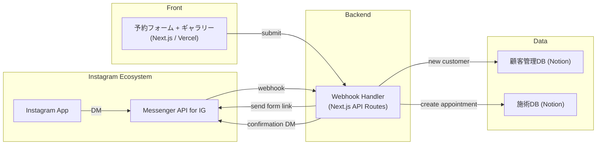

# 美容院顧客管理 × Instagram 連携システム — MVP 仕様書

## 1. 目的・スコープ

| 項目 | 内容 |
|------|------|
| **目的** | 欧米の美容院・ネイルサロンが Instagram DM を通じて予約受付・顧客管理・ポートフォリオ共有を自動化する仕組みを提供する |
| **対象市場** | 北米、欧州（英語・スペイン語・フランス語圏） |
| **対象機能（MVP）** | 1. Instagram DM 受信 → 予約意図の自動判定 2. 予約フォーム（Next.js）への誘導 3. Notion 顧客DB・施術DB 登録 4. 施術後フォローアップDM（レビュー依頼） 5. ポートフォリオギャラリー表示 |
| **除外範囲** | 決済連携、在庫管理、スタッフシフト管理 |

---

## 2. システム構成図

---

## 3. データモデル

### 3.1 顧客DB
| プロパティ | 型 | 備考 |
|------------|----|------|
| 名前 (title) | Title | 顧客名 |
| Instagram ID | Rich text | 主キー（IGSID） |
| Instagram ユーザー名 | Rich text | @handle |
| メールアドレス | Email | |
| 電話番号 | Phone | |
| 肌タイプ | Select | normal / dry / oily / sensitive |
| アレルギー | Text | |
| 来店回数 | Number | Rollup |
| 最終来店日 | Date | Rollup |
| VIPフラグ | Checkbox | |
| 備考 | Text | |

### 3.2 施術DB
| プロパティ | 型 | 備考 |
|------------|----|------|
| 施術ID (title) | Title | YYYYMMDD_名前_メニュー |
| 顧客 | Relation → 顧客DB | |
| 予約日時 | Date | ISO8601 |
| メニュー | Select | haircut / color / nails / facial / massage |
| スタイリスト | Select | |
| 参考画像 | URL | Instagram投稿URLなど |
| 施術後写真 | URL | ポートフォリオ用 |
| 金額 | Number | |
| ステータス | Status | 予約→施術中→完了→フォロー済 |
| レビュー依頼済 | Checkbox | |
| 備考 | Text | |

---

## 4. コンポーネント設計

### 4.1 予約フォーム + ギャラリー (Next.js)

| ルート | 内容 |
|--------|------|
| `/` | 予約フォーム（メニュー選択・日時・参考画像URL） |
| `/gallery` | 施術後写真ギャラリー（Notion DBから取得・表示） |

### 4.2 Webhook Handler

| トリガー | 処理 |
|----------|------|
| Instagram DM 受信 | 1. 顧客DB検索/作成 2. 予約意図判定（book, appointment, 予約） 3. フォームリンク送信 |
| フォーム送信 | 1. 施術DB作成 2. Instagram DM確認メッセージ 3. Slack通知 |
| 施術完了後（手動トリガー） | レビュー依頼DM送信 |

---

## 5. Instagram Messenger API 連携

- Meta Messenger API for Instagram
- Webhook: `POST /webhook` → messaging events
- DM送信: `POST /v17.0/me/messages` with `recipient.id` = IGSID
- 画像送信対応（施術後写真の共有）

---

## 6. セキュリティ

- Webhook署名検証（X-Hub-Signature-256）
- IGSID は内部IDとして管理（公開しない）
- Notion APIトークンは環境変数で管理
- HTTPS必須

---

## 7. 拡張性

- Googleカレンダー連携
- Stripe決済（施術後オンライン決済）
- Instagram投稿自動取得（ポートフォリオ自動更新）
- リピーター向け自動クーポン配信
