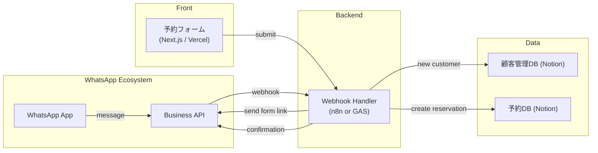

# 餐厅予約管理 × WhatsApp 連携システム — MVP 仕様書

## 1. 目的・スコープ

| 項目 | 内容 |
|------|------|
| **目的** | 東南アジア・中東の飲食店が WhatsApp Business を通じて予約受付・顧客管理を自動化する仕組みを提供する |
| **対象市場** | 東南アジア（シンガポール、タイ、マレーシア）、中東（UAE、サウジ） |
| **対象機能（MVP）** | 1. WhatsApp メッセージ受信 → 予約意図の自動判定 2. 予約フォーム（Next.js）への誘導 3. GAS / n8n 経由で Notion 顧客DB・予約DB 登録 4. 予約確認メッセージの自動返信 5. リマインダー通知（予約前日） |
| **除外範囲** | 決済連携、POS連携、メニュー管理 |

---

## 2. システム構成図

---

## 3. データモデル

### 3.1 顧客DB
| プロパティ | 型 | 備考 |
|------------|----|------|
| 名前 (title) | Title | 顧客名 |
| WhatsApp番号 | Phone | 主キー（E.164形式） |
| プロフィール名 | Rich text | WhatsApp表示名 |
| 言語 | Select | en / th / ar / zh / ms |
| 来店回数 | Number | 予約DBからRollup |
| 最終来店日 | Date | 予約DBからRollup |
| VIPフラグ | Checkbox | 来店5回以上で自動ON |
| アレルギー・備考 | Text | |
| ステータス | Select | active / blocked |

### 3.2 予約DB
| プロパティ | 型 | 備考 |
|------------|----|------|
| 予約ID (title) | Title | YYYYMMDD_名前 |
| 顧客 | Relation → 顧客DB | |
| 予約日時 | Date | ISO8601 |
| 人数 | Number | |
| 席タイプ | Select | indoor / outdoor / private |
| 特別リクエスト | Text | 誕生日、アレルギー等 |
| ステータス | Status | 仮予約→確定→来店→キャンセル |
| リマインダー送信済 | Checkbox | |

---

## 4. コンポーネント設計

### 4.1 予約フォーム (Next.js)

| 項目 | 内容 |
|------|------|
| **ルーティング** | `/` — 予約フォーム（多言語対応） |
| **主要処理** | 1. URLパラメータから `phone`, `lang` を取得 2. フォーム入力（日時・人数・席タイプ・リクエスト） 3. API経由でwebhookに送信 |
| **多言語** | i18n: en, th, ar, zh, ms |
| **UI** | レスポンシブ、WhatsAppカラースキーム（#25D366） |

### 4.2 Webhook Handler

| トリガー | 処理 |
|----------|------|
| WhatsApp message received | 1. 顧客DB検索/作成 2. 予約意図判定（キーワード: reserve, book, 予約） 3. フォームリンク送信 |
| フォーム送信 | 1. 予約DB作成 2. WhatsApp確認メッセージ送信 3. Slack通知（店舗スタッフ向け） |
| 定時（毎朝9時） | 翌日予約のリマインダー送信 |

---

## 5. WhatsApp Business API 連携

- Meta Cloud API（無料枠: 1000会話/月）
- Webhook verification: `GET /webhook?hub.verify_token=...`
- メッセージ受信: `POST /webhook` → messages array
- メッセージ送信: `POST /v17.0/{phone_number_id}/messages`
- テンプレートメッセージ: 予約確認・リマインダー用（事前承認必要）

---

## 6. セキュリティ

- Webhook署名検証（X-Hub-Signature-256）
- 電話番号はE.164形式で正規化
- Notion APIトークンはスクリプトプロパティ/環境変数で管理
- HTTPS必須

---

## 7. 拡張性

- Google Calendar 連携（予約→カレンダー自動登録）
- 多店舗対応（店舗IDパラメータ追加）
- メニュー画像送信（WhatsApp media message）
- 顧客セグメント配信（VIP向け特別オファー）
